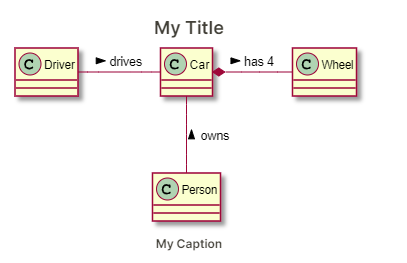

# Logseq - Diagrams as Code

[Logseq](https://github.com/logseq/logseq) plugin that lets you create diagrams (and other visualizations) from textual
representation (aka 'Diagrams as Code').


## Features

### Diagrams

- [PlantUML](https://plantuml.com/)
- [BPMN](https://en.wikipedia.org/wiki/Business_Process_Model_and_Notation)
- [Bytefield](https://texdoc.org/serve/bytefield.pdf/0)
- [BlockDiag](http://blockdiag.com/en/blockdiag/index.html)
- [SeqDiag](http://blockdiag.com/en/seqdiag/index.html)
- [ActDiag](http://blockdiag.com/en/actdiag/index.html)
- [NwDiag](http://blockdiag.com/en/nwdiag/index.html)
- [Ditaa](http://ditaa.sourceforge.net/)
- [Graphviz](https://graphviz.org/)
- [Mermaid](https://mermaid-js.github.io/mermaid/#/)
- [Nomnoml](https://www.nomnoml.com/)
- [Erd](https://hackage.haskell.org/package/erd)
- [Pikchr](https://pikchr.org/)
- [Structurizr](https://structurizr.com/)
- [Vega](https://vega.github.io/)
- [WaveDrom](https://wavedrom.com/)
- [D2](https://d2lang.com/)

### Math

Additionally, the plugin supports [AsciiMath](http://asciimath.org/) and [TeX](https://en.wikipedia.org/wiki/TeX) to
display mathematical formulas.

*Note that Logseq already supports [TeX-style](https://katex.org/) inline math (type *$$* to try it out).    
Another great option for writing math is [darwis-mathlive-plugin](https://github.com/hkgnp/darwis-mathlive-plugin).*

## Rendering

### Kroki

Most diagram types are rendered using the awesome [kroki.io](https://kroki.io/) API.

If you don't want to send your diagrams to a third party, there is the possibility
to [host it in your own infrastructure](https://docs.kroki.io/kroki/setup/install/).

You can change the kroki URL in your plugin config accordingly:

    {
        "kroki": {
            "baseUrl": "https://my-own-kroki-serice/"
        }
    }

## Configure Slash-Commands

### Disable unused commands

The plugin offers a lot of different diagram types.     
Since one usually uses only a small part of them,
you can explicitly select the renderers that are relevant for you to avoid the large amount of unnecessary commands.

E.g. to enable commands for PlantUml and Mermaid diagrams only:

    {
        "commands": {
            "renderers": ["plantuml", "mermaid"]
        }
    }

## Decorating Diagrams

There are some options to decorate your diagrams.

### Adding title and caption

You can add a title and a caption to each diagram.  
To do that, you have to specify *diagram options*.

Diagram options are provided as a *renderer argument*, where each option is a key-value pair with key and value
separated by '='.    
Multiple options are separated by '&' (e.g. `title=My Title&caption=My Caption`).

**Example**

Without diagram options:

```
{{renderer code_diagram,plantuml}}
```

With diagram options:

```
{{renderer code_diagram,plantuml,title=My Title&caption=My Caption}}
```

The result would look something like this:



### All Diagram Options

First, to better understand how the diagram options are used, let's have a look at the basic structure of the renderer
component (in 'pseudo html'):

```xml

<Renderer>
    <Container style="${options.containerStyle}">
        <Title style="${options.titleStyle}">${options.title}</Title>
        <Content style="${options.contentStyle}">
            <MyDiagram/>
        </Content>
        <Caption style="${options.captionStyle}">${options.caption}</Caption>
    </Container>
</renderer>
```

List of all options:

| Key            | Default | Example Value                      | Description         |
|----------------|---------|------------------------------------|---------------------|
| title          |         | My Title                           | title text          |
| titleStyle     |         | margin: 5px                        | title css style     |
| titleTag       | h4      | h3                                 | title html tag      |
| caption        |         | My Caption                         | caption text        |
| captionStyle   |         | font-style: italic; margin: 5px    | caption css style   |
| captionTag     | h6      | h5                                 | caption html tag    |
| containerStyle |         | background: lightgray; padding:5px | container css style |
| contentStyle   |         | background: #eeeeee                | content css style   |

And this is how it would look if we used all example values:


### Global Styling

If you have a preferred 'default look' for diagrams, it would be cumbersome to add the corresponding styles to each
diagram by hand.   
Luckily, for styling that applies to all your diagrams there are some CSS classes that you can use in your *custom.css*
file ( Settings / General / Custom theme ).

- dac-container
- dac-title
- dac-caption
- dac-content

_See pseudo html structure above_

#### Diagram-type specific styling

For global but diagram-type specific styling, just append `-$diagramType` to the CSS class name.     
E.g. `dac-container-plantuml` for PlantUML diagrams.
