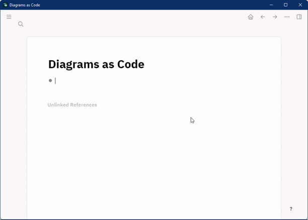

# Logseq - Diagrams as Code

Plugin that lets you create diagrams from textural representation (aka 'Diagrams as Code') within Logseq

## Diagram types

- [PlantUML](https://plantuml.com/)
- [Graphviz](https://graphviz.org/)
- [Mermaid](https://mermaid-js.github.io/mermaid/#/)
- [Nomnoml](https://www.nomnoml.com/)
- [Erd](https://hackage.haskell.org/package/erd)
- [BlockDiag](http://blockdiag.com/en/blockdiag/index.html)
- [SeqDiag](http://blockdiag.com/en/seqdiag/index.html)
- [ActDiag](http://blockdiag.com/en/actdiag/index.html)
- [NwDiag](http://blockdiag.com/en/nwdiag/index.html)
- [WaveDrom](https://wavedrom.com/)

## Rendering

For diagram types that can not be rendered locally, the plugin uses the awesome [kroki.io](https://kroki.io/)
service.

If you don't want to send your diagrams to a third party, there is the possibility
to [host it in your own infrastructure](https://docs.kroki.io/kroki/setup/install/).

You can change the kroki URL in your plugin config accordingly:

    {
        "kroki": {
            "baseUrl": "https://my-own-kroki-serice/"
        }
    }

## Styling

By default, the rendered diagram is not decorated (e.g. no border, shadow, margin etc.).

For simple styling you can provide a custom `dac-diagram-container` CSS class that applies to all diagrams.     
Or for diagram-type specific styling, you can use `dac-diagram-container-$type` classes.     
E.g. `dac-diagram-container-plantuml` for PlantUML diagrams.

